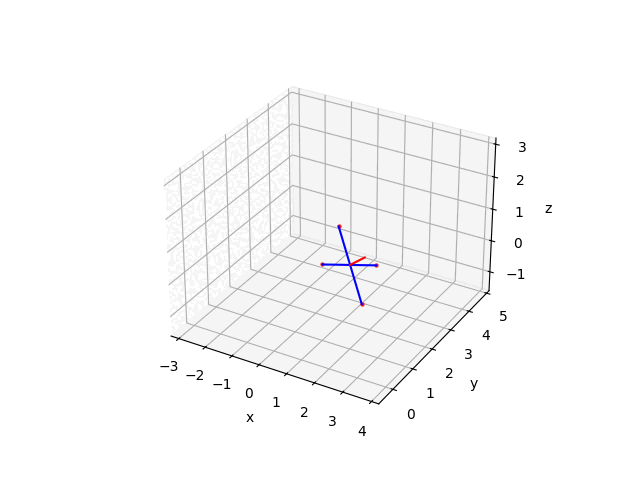

# Quadcopter math Simulation

Моделируется и визуализируется полёт квадрокоптера в 3D по заранее заданной траектории и ориентации.

## Задача

**Цель:**  
Показать поведение квадрокоптера, для которого известны значения координат \( x, y, z \) и углы Эйлера (ориентация) на каждом шаге.  
Это имитация движения БПЛА на основе результатов численного интегрирования параметров поступательного и углового движения (например, решения системы ОДУ метода Эйлера или Рунге-Кутты).

## Метод

- Координаты и ориентация на каждом шаге заполняются заранее (`x_values`, `y_values`, `z_values`, `theta_values`, `phi_values`).
- Ориентация считается через поворотные матрицы (из углов Эйлера).
- Визуализация реализована в matplotlib: анимируются траектория, оси корпуса и след от винтов.
- Для анимации используется `FuncAnimation`.

## Использование

1. Установите Python (3.x), numpy, matplotlib.
2. Запустите:
   
   python main.py
   

3. Готовая анимация будет сохранена в файл `animation.gif` (пример ниже).
   

---
